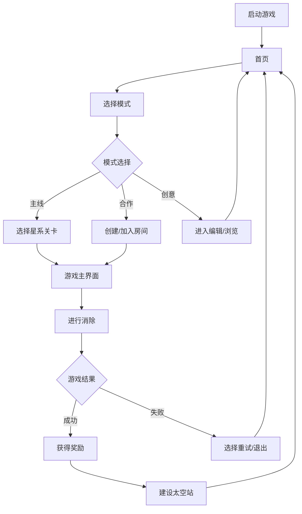

# 产品交互文档：《星海迷航》微信小游戏

## 1. 文档概述

### 1.1 项目信息

| 项目         | 内容                                           |
| ------------ | ---------------------------------------------- |
| 项目名称     | 《星海迷航》                                   |
| 版本         | 1.0                                            |
| 文档版本     | 1.0                                            |
| 创建日期     | 2026年3月3日                                   |
| 适用平台     | 微信小游戏（主平台）                           |
| 交互设计目标 | 清晰的消除体验、沉浸的宇宙探索、流畅的成长系统 |

### 1.2 设计原则

- **简洁直观**：降低学习成本，3分钟内理解核心玩法
- **沉浸体验**：科幻风格UI，配合空间音效
- **策略引导**：明确提示场上奖励图案，但不强迫
- **流畅反馈**：每次操作都有即时视觉反馈
- **适配性**：兼顾高中低端设备，保证流畅运行

## 2. 整体信息架构

### 2.1 功能结构图

```
《星海迷航》
├── 首页
│   ├── 开始探索（进入游戏）
│   ├── 我的太空站
│   ├── 星际探索（关卡选择）
│   ├── 合作模式
│   ├── 创意工坊
│   └── 设置
├── 游戏核心界面
│   ├── 三维星图区域
│   ├── 待消除槽区域
│   ├── 资源面板
│   ├── 技能按钮
│   └── 暂停菜单
├── 太空站建设界面
│   ├── 建筑列表
│   ├── 升级面板
│   ├── 科技树
│   └── 资源仓库
├── 合作模式界面
│   ├── 创建房间
│   ├── 加入房间
│   ├── 实时聊天
│   └── 任务分配
└── 创意工坊
    ├── 关卡编辑器
    ├── 社区精选
    ├── 我的创作
    └── 发布审核
```

### 2.2 核心用户流程



## 3. 界面详细设计

### 3.1 首页（启动后第一个界面）

#### 3.1.1 布局设计

```
┌─────────────────────────────────────┐
│ 状态栏 (WiFi/电量/时间)             │
├─────────────────────────────────────┤
│ 玩家信息 (头像/昵称/等级)            │
│ 当前资源 (星币/水晶/贡献点)          │
├─────────────────────────────────────┤
│ 主视觉区域: 动态太空站               │
│ 背景: 缓慢旋转的星云                 │
├─────────────────────────────────────┤
│ 主要功能按钮 (垂直排列)               │
│ ● 开始探索                          │
│ ● 我的太空站                        │
│ ● 星际探索                          │
│ ● 合作模式                          │
│ ● 创意工坊                          │
│ ● 排行榜                            │
├─────────────────────────────────────┤
│ 底部导航:                           │
│ [首页] [活动] [邮件] [商店] [设置]   │
└─────────────────────────────────────┘
```

#### 3.1.2 交互说明

1. **玩家信息区域**
   - 点击头像：弹出个人信息面板
   - 长按资源图标：显示获取途径
   - 下拉刷新：同步最新数据

2. **主视觉区域**
   - 左右滑动：旋转太空站视角
   - 点击太空站建筑：快速进入建筑管理
   - 双指缩放：查看太空站细节

3. **功能按钮**
   - 点击按钮：进入对应界面
   - 按钮有呼吸动画效果
   - 新内容有红点提示

4. **底部导航**
   - 点击切换，当前页面高亮
   - 长按功能按钮显示功能描述
   - 有新消息时有数字角标

### 3.2 游戏核心界面（单局游戏）

#### 3.2.1 布局设计

```
┌─────────────────────────────────────┐
│ 关卡信息 (关卡名)     │
├─────────────────────────────────────┤
│ 三维星图区域 (主要游戏区域)           │
│ 可360度旋转的立方体空间              │
│ 方块有轻微浮动效果                   │
├─────────────────────────────────────┤
│ 待消除槽 (8个槽位)                   │
│ 每个槽位有高亮边框             │
├─────────────────────────────────────┤
│ 资源栏:                          │
│ ● 当前能量: XX                  │
│ ● 收集资源: 金属/晶体/生态           │
│ ● 倒计时进度条: 100% --> 0(消除槽内3个相同方块，增加倒计时)           │
├─────────────────────────────────────┤
│ 底部快捷操作:                        │
│ [回溯] [扫描] [重组]      │
└─────────────────────────────────────┘
```

#### 3.2.2 核心交互机制

1. **方块选择**
   - 点击方块：方块缩小动画 → 移入待消除槽
   - 长按方块：高亮显示该方块所属的奖励图案
   - 滑动调整：单指滑动调整视角角度

2. **待消除槽操作**
   - 槽内满足3个相同：自动消除，有粒子特效
   - 槽位将满时：边框变为红色闪烁预警

3. **视角控制**
   - 滑动旋转：实时跟随手指移动
   - 缩放功能：双指捏合缩放视野

4. **实时反馈**
   - 选中方块：发光边框 + 轻微上浮
   - 可消除图案：半透明高亮边框
   - 获得资源：资源图标飞向资源栏

5. **底部快捷操作**
   - 点击[回溯]：撤销上一步操作
   - 点击[扫描]：高亮显示场上的奖励组合，不同奖励（金属/晶体/生态）不同颜色，如一个方块符合多个奖励组合，按生态>晶体>金属权重显示，3s后自动消失
   - 点击[重组]：随机重排场上的方块，保持方块位置不变，只是将场上剩余方块的颜色打乱

### 3.3 太空站建设界面

#### 3.3.1 布局设计

```
┌─────────────────────────────────────┐
│ 顶部导航: [总览] [建筑] [科技] [仓库] │
├─────────────────────────────────────┤
│ 太空站预览区域 (可缩放/旋转)          │
│ ● 已建建筑高亮                        │
│ ● 可建位置闪烁提示                    │
├─────────────────────────────────────┤
│ 建筑列表 (左侧)                       │
│ ● 分类: 能源/生产/科研/防御/装饰      │
│ ● 每个建筑显示: 名称/图标/资源需求     │
├─────────────────────────────────────┤
│ 建造面板 (右侧)                       │
│ ● 当前选中建筑3D模型                  │
│ ● 详细属性说明                        │
│ ● 所需资源清单                        │
│ ● 建造/升级按钮                       │
├─────────────────────────────────────┤
│ 快速操作:                             │
│ [一键收取] [快速建造] [自动升级]       │
└─────────────────────────────────────┘
```

#### 3.3.2 交互说明

1. **建造流程**
   - 从列表选择建筑 → 预览区域显示虚影 → 拖动到合适位置 → 点击确认建造 → 显示建造倒计时

2. **升级管理**
   - 点击已建建筑 → 弹出升级面板 → 显示当前等级和下一级效果 → 确认升级消耗资源

3. **科技研究**
   - 科技树可视化界面
   - 前置科技解锁后才能研究后续
   - 研究期间显示进度条
   - 可加速研究（消耗水晶）

### 3.4 合作模式界面

#### 3.4.1 房间界面

```
┌─────────────────────────────────────┐
│ 房间信息: 房主/模式/难度/人数限制     │
├─────────────────────────────────────┤
│ 玩家列表 (最多5人)                    │
│ ● 玩家1: 头像/昵称/准备状态           │
│ ● 玩家2: 头像/昵称/准备状态           │
│ ● ...                               │
├─────────────────────────────────────┤
│ 任务分配面板                          │
│ ● 每位玩家分配一个消除区域            │
│ ● 可拖动调整负责范围                  │
├─────────────────────────────────────┤
│ 聊天区域 (底部)                       │
│ ● 快捷消息按钮: 准备/开始/加油        │
│ ● 文字输入框 (可展开)                 │
├─────────────────────────────────────┤
│ 控制按钮:                             │
│ [准备/取消准备] [开始游戏] [离开房间]  │
└─────────────────────────────────────┘
```

## 4. 交互状态与反馈

### 4.1 操作反馈设计

| 操作类型 | 视觉反馈                        | 音效反馈       | 震动反馈 |
| -------- | ------------------------------- | -------------- | -------- |
| 点击方块 | 方块缩小10%，发光边框，轻微上浮 | 清脆点击声     | 轻微短震 |
| 槽内消除 | 爆炸粒子特效，方块消失动画      | 爆破声+收集音  | 中等震动 |
| 获得资源 | 资源图标飞向资源栏，数字跳动    | 金币掉落声     | 无       |
| 游戏失败 | 屏幕变暗，失败提示弹出          | 低沉警告声     | 长震动   |
| 游戏胜利 | 烟花特效，胜利界面弹出          | 胜利音乐       | 连续短震 |
| 能量不足 | 能量条闪烁红色                  | 电量不足提示音 | 轻微震动 |
| 建造完成 | 建筑发光，生长动画              | 建筑完成音效   | 无       |

### 4.2 特殊状态处理

1. **网络连接中断**
   - 显示浮动提示："网络连接中断，正在重连..."
   - 自动保存当前进度
   - 重连成功后提示："连接恢复"

2. **内存不足警告**
   - 当内存使用超过80%时
   - 提示："设备内存紧张，将优化显示效果"
   - 自动降低画质设置

3. **电量过低警告**
   - 电量低于20%时提示
   - 建议开启省电模式
   - 省电模式自动关闭部分特效

### 4.3 加载状态设计

1. **启动加载**
   - 显示动态太空站LOGO
   - 加载进度条+百分比
   - 底部显示小贴士

2. **场景切换**
   - 使用星际穿梭转场动画
   - 加载过程中显示趣味文案
   - 最长等待时间15秒，超时提示重试

3. **资源加载**
   - 远程资源显示缩略图占位
   - 加载完成后渐入显示
   - 加载失败显示默认图标

## 5. 新手引导设计

### 5.1 引导流程

```
1. 首次启动 → 基础操作教学（强制）
   - 点击方块
   - 槽内消除
   - 获得能量

2. 首次失败 → 策略教学（强制）
   - 场上图案识别
   - 高级资源获取

3. 首次胜利 → 建设引导（可选）
   - 进入太空站
   - 建造第一个建筑

4. 渐进式提示
   - 前5关每关引入1个新机制
   - 重要功能首次解锁时有引导
   - 可随时查看帮助页面
```

### 5.2 引导交互原则

- 使用半透明黑色遮罩突出可操作区域
- 引导手指图标指向操作位置
- 简洁的文字说明（不超过2行）
- 可跳过但鼓励完成
- 已完成的引导不再重复显示

## 6. 适配方案

### 6.1 屏幕适配

| 设备类型             | 布局策略               | 字体大小 | 操作热区 |
| -------------------- | ---------------------- | -------- | -------- |
| 大屏手机 (≥6.5")     | 两侧留白，内容居中     | 标准     | 44pt     |
| 中屏手机 (5.8"-6.4") | 全屏利用，适当缩小间距 | 标准     | 44pt     |
| 小屏手机 (<5.8")     | 紧凑布局，减少装饰元素 | 缩小10%  | 44pt     |
| 平板横屏             | 左右分栏，充分利用宽度 | 放大10%  | 60pt     |

### 6.2 性能分级

| 性能等级 | 设备特征            | 图形质量 | 特效级别 | 同时渲染方块数 |
| -------- | ------------------- | -------- | -------- | -------------- |
| 高端     | 旗舰机型，≥6GB内存  | 高       | 全特效   | ≤60个          |
| 中端     | 主流机型，4-6GB内存 | 中       | 简化特效 | ≤45个          |
| 低端     | 入门机型，≤4GB内存  | 低       | 基本特效 | ≤30个          |

## 7. 动效规范

### 7.1 基础动效参数

| 动效类型 | 持续时间   | 缓动函数    | 应用场景               |
| -------- | ---------- | ----------- | ---------------------- |
| 点击反馈 | 150ms      | ease-out    | 按钮点击，方块选择     |
| 页面转场 | 300ms      | ease-in-out | 界面切换               |
| 元素出现 | 200-400ms  | ease-out    | 弹窗出现，新元素显示   |
| 元素消失 | 200ms      | ease-in     | 弹窗关闭，元素移除     |
| 连续动画 | 600-1000ms | linear      | 资源飞行动画，建造过程 |

### 7.2 核心动效描述

1. **方块进入槽位**
   - 位置移动：从场上到槽内
   - 缩放动画：100% → 90% → 100%（轻微弹跳）
   - 旋转：无旋转或轻微旋转（≤15度）

2. **消除特效**
   - 第一阶段：方块抖动（0.1s）
   - 第二阶段：方块破碎为粒子（0.2s）
   - 第三阶段：粒子飞散（0.3s）

3. **资源获取**
   - 产生点：消除位置
   - 轨迹：贝塞尔曲线飞向目标
   - 终点：轻微弹跳效果

## 8. 无障碍设计

### 8.1 视觉无障碍

- 支持系统字体大小设置
- 高对比度模式：黑白模式，增强对比度
- 色盲友好：不使用红绿作为唯一区分
- 重要操作有明确的视觉焦点

### 8.2 操作无障碍

- 所有按钮有充足点击区域（≥44×44pt）
- 支持键盘/手柄操作（外设扩展）
- 长按替代复杂手势
- 操作可撤销机制

---

## 附录：界面状态清单

### A.1 主界面状态

1. 正常状态
2. 加载状态
3. 网络断开状态
4. 维护状态
5. 活动提示状态

### A.2 游戏内状态

1. 进行中
2. 暂停中
3. 胜利状态
4. 失败状态
5. 断线重连状态
6. 时间结束状态

### A.3 按钮状态

1. 正常
2. 按下
3. 不可用
4. 加载中
5. 选中/激活

### A.4 文本输入状态

1. 默认
2. 聚焦
3. 输入中
4. 错误
5. 成功

---

**文档更新记录**
| 版本 | 日期 | 修改内容 | 修改人 |
|------|------|---------|--------|
| 1.0 | 2026/3/3 | 初始版本，包含核心交互设计 | 产品团队 |
